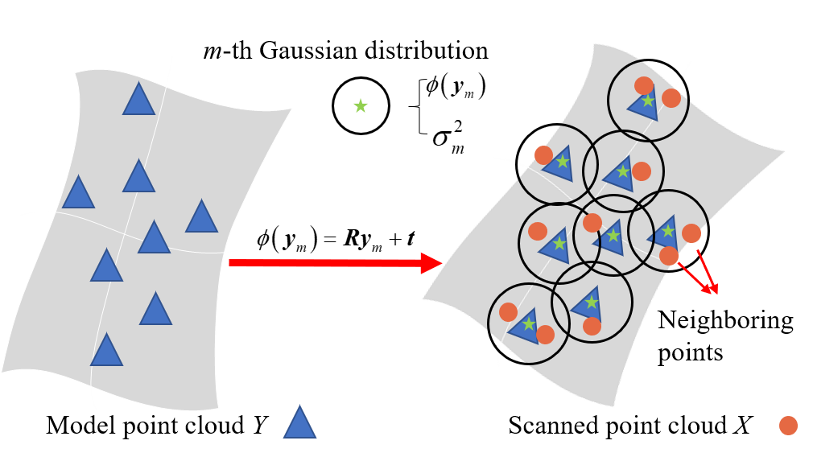

I am Su Lingjie(苏凌杰), a master student in the second year. from the State Key Laboratory of Intelligent Manufacturing in Huazhong University of Science and Technology (HUST). supervised by Prof. WenLong Li. Before this, I obtained bachlor degree in School of Mechanical Science and Engineering in HUST. My research focuses on point cloud registration, surface reconstruction, and mesh denoising. The research topics provide the robots the ability to percept and understand the surroundings and high quality data for robotic inspection and measurement.

**Algorithm Theory**: The mathematical theory in my research includs optimization theory, statistics (especially Gaussian Mixture Model and EM algorithm), iterative solution method and preconditioning of linear function, and bilateral filtering method.

**Algorithm Application**: These designed algorithms can be used for robot pose estimation, localization of parts, evaluation of machining quality, and visualization.

you can find my CV [here](../assets/CV.pdf).

Publications
======

1. **L. Su**, W. Xu, and W. Li, “Robust point cloud registration in robotic inspection with locally consistent gaussian mixture model,” 
*IEEE Trans. Instrum. Meas.*, 2024, Under Review.
2. **L. Su** et al., “An adaptive anisotropic bilateral filtering method for mesh data in scale space,” *Meas. Sci. Technol.*, vol 35, no. 6, 
2024, [doi: 10.1088/1361-6501/ad317e](https://iopscience.iop.org/article/10.1088/1361-6501/ad317e)

Research Experience
======

Point Cloud Reconstruction and Multi-view Registration
------

In robotic inspection of aviation parts, achieving accurate pairwise point cloud registration between scanned and model data is essential. However, noise and outliers generated in robotic scanned data can compromise registration accuracy. To mitigate this challenge, this article proposes a probability-based registration method utilizing Gaussian Mixture Model (GMM) with local consistency constraint. This method converts the registration problem into a model fitting one, constraining the similarity of posterior distributions between neighboring points to enhance correspondence robustness. We employ the Expectation Maximization algorithm iteratively to find optimal rotation matrix and translation vector while obtaining GMM parameters. Both E-step and M-step have closed-form solutions. Simulation and actual experiments confirm the method's effectiveness, reducing root mean square error by 20% despite the presence of noise and outliers. The proposed method excels in robustness and accuracy compared to existing methods.

Probability-based Point Cloud Registration
------

Anosotropic Bilateral Mesh Filtering
------

Implicit B-spline Surface Reconstruction
------

A data-driven personal website
======
Like many other Jekyll-based GitHub Pages templates, Academic Pages makes you separate the website's content from its form. The content & metadata of your website are in structured markdown files, while various other files constitute the theme, specifying how to transform that content & metadata into HTML pages. You keep these various markdown (.md), YAML (.yml), HTML, and CSS files in a public GitHub repository. Each time you commit and push an update to the repository, the [GitHub pages](https://pages.github.com/) service creates static HTML pages based on these files, which are hosted on GitHub's servers free of charge.

Many of the features of dynamic content management systems (like Wordpress) can be achieved in this fashion, using a fraction of the computational resources and with far less vulnerability to hacking and DDoSing. You can also modify the theme to your heart's content without touching the content of your site. If you get to a point where you've broken something in Jekyll/HTML/CSS beyond repair, your markdown files describing your talks, publications, etc. are safe. You can rollback the changes or even delete the repository and start over -- just be sure to save the markdown files! Finally, you can also write scripts that process the structured data on the site, such as [this one](https://github.com/academicpages/academicpages.github.io/blob/master/talkmap.ipynb) that analyzes metadata in pages about talks to display [a map of every location you've given a talk](https://academicpages.github.io/talkmap.html).

Getting started
======
1. Register a GitHub account if you don't have one and confirm your e-mail (required!)
1. Fork [this repository](https://github.com/academicpages/academicpages.github.io) by clicking the "fork" button in the top right. 
1. Go to the repository's settings (rightmost item in the tabs that start with "Code", should be below "Unwatch"). Rename the repository "[your GitHub username].github.io", which will also be your website's URL.
1. Set site-wide configuration and create content & metadata (see below -- also see [this set of diffs](http://archive.is/3TPas) showing what files were changed to set up [an example site](https://getorg-testacct.github.io) for a user with the username "getorg-testacct")
1. Upload any files (like PDFs, .zip files, etc.) to the files/ directory. They will appear at https://[your GitHub username].github.io/files/example.pdf.  
1. Check status by going to the repository settings, in the "GitHub pages" section

Site-wide configuration
------
The main configuration file for the site is in the base directory in [_config.yml](https://github.com/academicpages/academicpages.github.io/blob/master/_config.yml), which defines the content in the sidebars and other site-wide features. You will need to replace the default variables with ones about yourself and your site's github repository. The configuration file for the top menu is in [_data/navigation.yml](https://github.com/academicpages/academicpages.github.io/blob/master/_data/navigation.yml). For example, if you don't have a portfolio or blog posts, you can remove those items from that navigation.yml file to remove them from the header. 

Create content & metadata
------
For site content, there is one markdown file for each type of content, which are stored in directories like _publications, _talks, _posts, _teaching, or _pages. For example, each talk is a markdown file in the [_talks directory](https://github.com/academicpages/academicpages.github.io/tree/master/_talks). At the top of each markdown file is structured data in YAML about the talk, which the theme will parse to do lots of cool stuff. The same structured data about a talk is used to generate the list of talks on the [Talks page](https://academicpages.github.io/talks), each [individual page](https://academicpages.github.io/talks/2012-03-01-talk-1) for specific talks, the talks section for the [CV page](https://academicpages.github.io/cv), and the [map of places you've given a talk](https://academicpages.github.io/talkmap.html) (if you run this [python file](https://github.com/academicpages/academicpages.github.io/blob/master/talkmap.py) or [Jupyter notebook](https://github.com/academicpages/academicpages.github.io/blob/master/talkmap.ipynb), which creates the HTML for the map based on the contents of the _talks directory).

**Markdown generator**

I have also created [a set of Jupyter notebooks](https://github.com/academicpages/academicpages.github.io/tree/master/markdown_generator
) that converts a CSV containing structured data about talks or presentations into individual markdown files that will be properly formatted for the Academic Pages template. The sample CSVs in that directory are the ones I used to create my own personal website at stuartgeiger.com. My usual workflow is that I keep a spreadsheet of my publications and talks, then run the code in these notebooks to generate the markdown files, then commit and push them to the GitHub repository.

How to edit your site's GitHub repository
------
Many people use a git client to create files on their local computer and then push them to GitHub's servers. If you are not familiar with git, you can directly edit these configuration and markdown files directly in the github.com interface. Navigate to a file (like [this one](https://github.com/academicpages/academicpages.github.io/blob/master/_talks/2012-03-01-talk-1.md) and click the pencil icon in the top right of the content preview (to the right of the "Raw | Blame | History" buttons). You can delete a file by clicking the trashcan icon to the right of the pencil icon. You can also create new files or upload files by navigating to a directory and clicking the "Create new file" or "Upload files" buttons. 

Example: editing a markdown file for a talk

For more info
------
More info about configuring Academic Pages can be found in [the guide](https://academicpages.github.io/markdown/). The [guides for the Minimal Mistakes theme](https://mmistakes.github.io/minimal-mistakes/docs/configuration/) (which this theme was forked from) might also be helpful.
