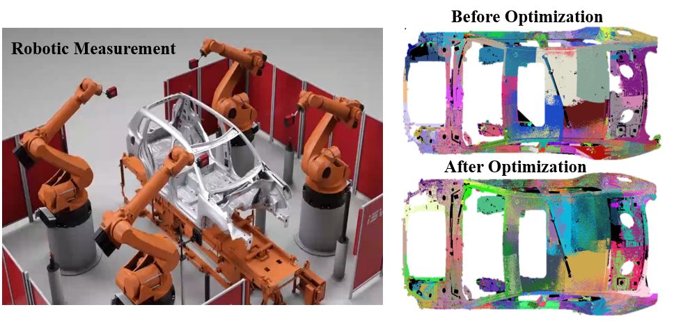

I am Su Lingjie(苏凌杰), a master student in the second year. from the State Key Laboratory of Intelligent Manufacturing in Huazhong University of Science and Technology (HUST). supervised by Prof. WenLong Li. Before this, I obtained bachlor degree in School of Mechanical Science and Engineering in HUST. My research focuses on point cloud registration, surface reconstruction, and mesh denoising. The research topics provide the robots the ability to percept and understand the surroundings and high quality data for robotic inspection and measurement.

**Algorithm Theory**: The mathematical theory in my research includs optimization theory, statistics (especially Gaussian Mixture Model and EM algorithm), iterative solution method and preconditioning of linear function, and bilateral filtering method.

**Algorithm Application**: These designed algorithms can be used for robot pose estimation, localization of parts, evaluation of machining quality, and visualization.

you can find my CV [here](../assets/CV.pdf).

Publications
======

1. **L. Su**, W. Xu, and W. Li, “Robust point cloud registration in robotic inspection with locally consistent gaussian mixture model,” 
*IEEE Trans. Instrum. Meas.*, 2024, Under Review.
2. **L. Su** et al., “An adaptive anisotropic bilateral filtering method for mesh data in scale space,” *Meas. Sci. Technol.*, vol 35, no. 6, 
2024, [doi: 10.1088/1361-6501/ad317e](https://iopscience.iop.org/article/10.1088/1361-6501/ad317e)

Research Experience
======

Point Cloud Reconstruction and Multi-view Registration
------

In the point cloud measurement process, the 3D sensor needs to be equipped at different positions due to the limited working range of the sensor or large size of the measured parts (such as car body). This project focuses on how to integrete the point clouds from different perspetives with the following procedures. (1) Estabilished binocular imaging model and calibrated the internal and external parameters of camera. Reconstructed the centers of marked points, including elliptic fitting, poar constraints and triangulartion. Matched marked points under different perspectives with spatial invariant characteristics and registered point clouds coarsly. (2) Construced the objective function of minimizing the mean square error of correspondent points in overlapping areas. Used gradient decent method and graph optimization method to solve the optimization problem.

Probability-based Point Cloud Registration
------

In robotic inspection of aviation parts, achieving accurate pairwise point cloud registration between scanned and model data is essential. However, noise and outliers generated in robotic scanned data can compromise registration accuracy. To mitigate this challenge, this article proposes a probability-based registration method utilizing Gaussian Mixture Model (GMM) with local consistency constraint. This method converts the registration problem into a model fitting one, constraining the similarity of posterior distributions between neighboring points to enhance correspondence robustness. We employ the Expectation Maximization algorithm iteratively to find optimal rotation matrix and translation vector while obtaining GMM parameters. Both E-step and M-step have closed-form solutions. Simulation and actual experiments confirm the method's effectiveness, reducing root mean square error by 20% despite the presence of noise and outliers. The proposed method excels in robustness and accuracy compared to existing methods.

Anosotropic Bilateral Mesh Filtering
------

Three-dimensional mesh data of parts, such as blades and engine bodies, have been widely used in industrial fields. Due to the different kinds of noise during mesh acquisition and the machining deficiency of parts, the mesh quality tends to be insufficient for subsequent operations. Therefore, mesh denoising is a necessary and critical procedure to improve mesh quality. Existing methods commonly apply geometry features smoothing, which may also create unexpected results, such as volume shrinkage and blurring of sharp edges. This paper proposed an adaptive anisotropic bilateral filtering method for mesh data in scale space. Firstly, the mesh is decomposed into a smooth base with low frequency and a height vector field with high frequency based on scale space theory. The denoising of the vertex spatial field is transformed into the denoising of the height vector field, aiming to only consider high-frequency information. Secondly, the bilateral filter scheme with the anisotropic Gaussian kernel is proposed to denoise the height vector field, removing noise mixed with features. The parameters in the bilateral filter scheme are chosen adaptively by maximizing the designed probability density function. The mean square angular error of the proposed method is less than 0.15rad, which is superior to the general-purpose algorithms, for instance, Laplacian filtering, bilateral mesh filtering and bilateral normal filtering algorithm.

Implicit B-spline Surface Reconstruction
------

Teaching and volunteer
======

Volunteer for high-school student tour in HUST
------

    

I once volunteered to guide high school students visiting Huazhong University of Science and Technology (HUST). My main responsibilities included leading them to various sites around the campus, introducing them to information about the university, and providing details about our school's development and some of our research achievements. 

Teaching assistent in experimental class for exchange students
------

    

I am serving as a teaching assistant for a robotics measurement course during a summer exchange program at Huazhong University of Science and Technology. My responsibilities include explaining the principles and operational procedures of robotic control, the principles and usage of 3D scanners, and the principles of point cloud registration to eight exchange students from France, as well as guiding them in completing robotic measurement experiments.

