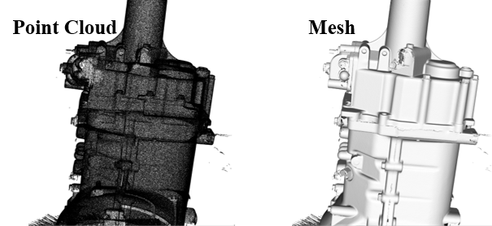

My name is Su Lingjie(苏凌杰), a second-year master's student at the State Key Laboratory of Intelligent Manufacturing Equipment and Technology at Huazhong University of Science and Technology (HUST), under the supervision of <a href="https://mse.hust.edu.cn/info/1142/1340.htm">Prof. Wenlong Li</a>. I previously earned my bachlor's degree from the School of Mechanical Science and Engineering at HUST. My research focuses on point cloud registration, surface reconstruction, and mesh denoising. These research topics enhance the ability of robots to perceive and understand their surroundings, providing high-quality data for robotic inspection and measurement.   

<strong>Algorithm Theory</strong>: The mathematical theory in my research includs optimization theory, statistics (especially Gaussian Mixture Model and EM algorithm), matrix theory, iterative solution methods and preconditioning of linear functions, and bilateral filtering method.   

<strong>Algorithm Application</strong>: These designed algorithms can be used for robot pose estimation, localization of parts, evaluation of machining quality, and visualization.

You can find my CV [here](../assets/CV.pdf).

Publications
======

1. <strong>L. Su</strong>, W. Xu, and W. Li, “Robust point cloud registration in robotic inspection with locally consistent gaussian mixture model,” <i>IEEE Trans. Instrum. Meas.</i>, 2024, Under Review.   

2. <strong>L. Su</strong> et al., “An adaptive anisotropic bilateral filtering method for mesh data in scale space,” <i>Meas. Sci. Technol.</i>, vol 35, no. 6, 2024, <a href="https://iopscience.iop.org/article/10.1088/1361-6501/ad317e">doi: 10.1088/1361-6501/ad317e</a>
   

Research Experience
======

1.Point Cloud Reconstruction and Multi-view Registration
--------

In the point cloud measurement process, the 3D sensor needs to be positioned at various locations due to the limited working range or the large size of the measured parts, such as a car body. This project focuses on how to integrete the point clouds from different perspetives through the following procedures. (1) Estabilishing binocular imaging model and calibrating the internal and external parameters of the stereo cameras. (2) Reconstructing the centers of marked points, including elliptic fitting, polar constraints and triangulation. Matching marked points under different perspectives with spatial invariant characteristics and registering point clouds coarsly. (3) Constructing the objective function of minimizing the mean square error of corresponding points in overlapping areas. Solving the optimization problem with gradient decent method and graph optimization method

2.Probability-based Point Cloud Registration
--------

In the area of robotic inspection, achieving accurate pairwise point cloud registration between scanned and model data is essential. However, noise and outliers generated in robotic scanned data can compromise registration accuracy. To mitigate this problem, this project proposes a probability-based registration method utilizing Gaussian Mixture Model (GMM) with local consistency constraint. This method converts the registration problem into a model-fitting one, constraining the similarity of posterior distributions between neighboring points to enhance correspondence robustness. We employ the Expectation Maximization algorithm iteratively to find the optimal rotation matrix and translation vector while obtaining GMM parameters. Both E-step and M-step have closed-form solutions. Extensive simulation and actual experiments confirm the method's robustness and accuracy.  
Now We are currently attempting to extend this method to multi-view registration to simultaneously estimate the accurate poses of multiple point clouds.

    

     

 

3.Anosotropic Bilateral Mesh Filtering
--------

Three-dimensional mesh data of parts, such as blades and engine bodies, have been widely used in industrial fields. Due to the different kinds of noise during mesh acquisition and the machining deficiency of parts, the mesh quality tends to be insufficient for subsequent operations. Therefore, mesh denoising is a necessary and critical procedure to improve mesh quality. Existing methods commonly apply geometry features smoothing, which may also create unexpected results, such as volume shrinkage and blurring of sharp edges. This paper proposed an adaptive anisotropic bilateral filtering method for mesh data in scale space. Firstly, the mesh is decomposed into a smooth base with low frequency and a height vector field with high frequency based on scale space theory. The denoising of the vertex spatial field is transformed into the denoising of the height vector field, aiming to only consider high-frequency information. Secondly, the bilateral filter scheme with the anisotropic Gaussian kernel is proposed to denoise the height vector field, removing noise mixed with features. The parameters in the bilateral filter scheme are chosen adaptively by maximizing the designed probability density function. The mean square angular error of the proposed method is less than 0.15rad, which is superior to the general-purpose algorithms, for instance, Laplacian filtering, bilateral mesh filtering and bilateral normal filtering algorithm.

4.Implicit B-spline Surface Reconstruction
--------

For better visualization and analysis, mesh data are requeied to be reconstructed from point cloud. Implict B-spline surface function is convenient for mesh reconstruction. First, we generate two inner data and outer data by moving original along the nomals, the two added data can gaurantee the direction of the surface. Then, we represent implict B-spline surface fitting as a least square problem. Finally, we add global tension constraint to control the smoothness and solve the least square problem. Now, we are trying to improve the local accuracy in high-curvature areas.

    

 

4.Software development for architectural point cloud
--------

I have developed two softwares for processing architectural point cloud. The first one is based on QT framework and includes data format conversion (ifc, obj, and pcd), data filtering and block, registration beteween measured data and model data, and construction progress estimation. The second one is based on MicroStation platform and includes data preprocessing, components extration (I-beam, angle steel, and tubes), and parameter calculation.

Teaching and Volunteer
======

1.Volunteer for high-school student tour in HUST
--------

    

I once volunteered to guide high school students visiting Huazhong University of Science and Technology (HUST). My main responsibilities included leading them to various sites around the campus, introducing them to information about the university, and providing details about our school's development and some of our research achievements.  

 

2.Teaching assistent in experimental class for exchange students
--------

    

I am serving as a teaching assistant for a robotics measurement course during a summer exchange program at Huazhong University of Science and Technology. My responsibilities include explaining the principles and operational procedures of robotic control, the principles and usage of 3D scanners, and the principles of point cloud registration to eight exchange students from France, as well as guiding them in completing robotic measurement experiments.

